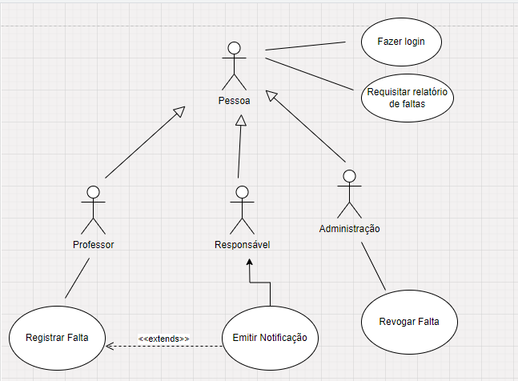

<h2><a href= "https://www.mackenzie.br">Universidade Presbiteriana Mackenzie</a></h2>
<h3><a href= "https://www.mackenzie.br/graduacao/sao-paulo-higienopolis/sistemas-de-informacao">Sistemas de Informação</a></h3>

*&lt;Sistema de Presenças&gt;*

>*Observação 1: A estrutura inicial deste documento é só um exemplo. O seu grupo deverá alterar esta estrutura de acordo com o que está sendo solicitado na disciplina.*

>*Observação 2: O índice abaixo não precisa ser editado se você utilizar o Visual Studio Code com a extensão **Markdown All in One**. Essa extensão atualiza o índice automaticamente quando o arquivo é salvo.*

**Conteúdo**

- [Autores](#autores)
- [Descrição do Projeto](#descrição-do-projeto)
- [Análise de Requisitos Funcionais e Não-Funcionais](#análise-de-requisitos-funcionais-e-não-funcionais)
- [Diagrama de Atividades](#diagrama-de-atividades)
- [Diagrama de Casos de Uso](#diagrama-de-casos-de-uso)
- [Descrição dos Casos de Uso](#descrição-dos-casos-de-uso)
- [Diagrama de Sequência](#diagrama-de-sequência)
- [Diagrama de Classes](#diagrama-de-classes)
- [Diagrama de Estados](#diagrama-de-estados)
- [Diagrama de Implantação](#diagrama-de-implantação)
- [Referências](#referências)

# Autores

* Enzo Ribeiro - 10418262 
* Gabriel Ken Kazama Geronazzo - 10418247 
* Lucas Pires de Camargo Sarai - 10418013
* Lucas Zanini da Silva - 10417361
  
# Descrição do Projeto

A Escola Infinito necessita de um sistema para controlar as presenças de seus alunos, pois a operação ainda é realizada totalmente em papel. Assim, esse projeto visa montar essa aplicação de forma a atender todos os requisitos e auxiliar a instituição em seu dia a dia.

# Análise de Requisitos Funcionais e Não-Funcionais

_Requisitos não funcionais:_ 
–	O sistema deve ser acessível a usuários com deficiências. 
–	O sistema deve respeitar as normas da LGPD. 
–	O sistema deve ser responsivo e possuir acesso a partir de qualquer dispositivo via web. 
 
_Requisitos funcionais:_ 
–	O sistema deve permitir que o professor registre faltas para os alunos.  
–	O sistema deve permitir gerar relatórios de faltas dos alunos, seguindo uma filtragem.  
–	O sistema deve emitir notificações aos responsáveis, caso o percentual de prenseça do aluno esteja abaixo de 80%. 

# Diagrama de Atividades

# Diagrama de Casos de Uso

# Descrição dos Casos de Uso

<h2>Especificação de Requisitos</h2>

| **Procurar aluno** | **Descrição** |
| :------- | :--- |
| Função | Buscar dados de um aluno. |
| Descrição | Buscar informações referentes a um aluno com base em seu Registro Acadêmico.|
| Entradas | Registro Acadêmico(RA) do aluno. | 
| Ator | Professor |
| Saída | Informações referentes ao aluno. |
| Destino | Tela de informações gerais do sistema. |
| Ação | O sistema busca no banco de dados o aluno especificado com base no Registro Acadêmico. Validando sua existência, retorna Nome e Turma. |
| Pré-condição | O aluno estar matriculado e ter seu Registro Acadêmico no sistema. |
| Pós-condição |  Informações solicitadas serem retornadas. |
| Efeitos | Nenhum. |

| **Registrar falta** | **Descrição** |
| :------- | :--- |
| Função | Cadastrar a ausência(falta) de um aluno em uma disciplina. |
| Descrição | Registra no sistema que o aluno estava ausente em uma aula, acrescendo essa falta ao total de faltas do aluno. |
| Entradas | Registro Acadêmico do aluno(RA), disciplina em que esteve ausente e o professor responsável. | 
| Atores | *Ativo*: Professor; *Passivo*: Responsável|
| Saída | Acréscimo no total de faltas do aluno no sistema. |
| Destino | Banco de dados do sistema (e responsável - Efeitos colaterais).|
| Ação | O sistema busca no banco de dados o aluno especificado. Com base nas informações da entrada, cadastra uma falta para esse aluno e calcula o percentual de presença. Se o percentual de presença estiver entre 75% e 80%, uma notificação via e-mail é emitida para os responsáveis. (ver *Notificação*). |
| Requer | Todas as informações de entrada são obrigatórias para possível contestação da falta no futuro. |
| Pré-condição | O aluno estar matriculado, aluno estar na disciplina e o aluno estar ausente na aula em que pretende-se registrar a falta. |
| Pós-condição | Verificar se a falta foi registrada. |
| Efeitos | Caso a porcentagem de presença do aluno esteja entre 75% e 80%, uma notificação deve ser enviada aos responsáveis. |

| **Revogar falta** | **Descrição** |
| :------- | :--- |
| Função | Remover do banco de dados a ausência(falta) cadastrada para um aluno em uma disciplina. |
| Descrição |Remove uma falta registrada para um aluno caso a falta tenha sido justificada (por exemplo, atestado), recalculando o total de faltas do aluno.|
| Entradas | Registro Acadêmico(RA) do aluno, disciplina em que esteve registrado como ‘ausente’ e o professor responsável. | 
| Ator | Professor. |
| Saída | Decréscimo no total de faltas do aluno no sistema. |
| Destino | Banco de dados do sistema. |
| Ação | O sistema busca no banco de dados o aluno especificado com base no RA. Com base nas informações da entrada, busca a falta armazenada no sistema. Retira essa falta, atualizando no banco de dados o total de faltas. |
| Requer | Todas as informações de entrada são obrigatórias, visando realizar a busca do aluno no banco de dados. |
| Pré-condição | O aluno estar matriculado, aluno estar na disciplina e o aluno estar registrado como ‘ausente’. |
| Pós-condição |Verificar se a falta foi revogada. |
| Efeitos| Nenhum. |

| **Gerar relatório de Faltas** | **Descrição** |
| :------- | :--- |
| Função | Criar um relatório em formato PDF para que os professores ou responsáveis vejam informações sobre a presença de um aluno (responsáveis e professores), turma, disciplina ou série (apenas professores). |
| Descrição | Gera um arquivo com dados da presença do grupo selecionado, dependendo da requisição e permissão feita pelo responsável ou professor. Caso um responsável tente gerar o relatório, apenas os dados do seu respectivo aluno serão expostos, caso seja um professor, ele deve indicar o que busca no relatório, uma turma, série ou disciplina. |
| Entradas | Aluno, turma, série ou disciplina. | 
| Ator | Professor ou Responsável. |
| Saída | Relatório em formato PDF. |
| Destino | Tela de informações gerais do sistema. |
| Ação | O sistema busca as faltas de uma lista de alunos conforme a seleção determinada pelo usuário e suas permissões. Por exemplo, caso o professor busque um relatório de faltas para uma turma específica, o sistema busca todos os alunos da turma, seus respectivos indicadores de presença e sumariza as informações num único relatório para o professor. |
| Requer | 1 aluno cadastrado no sistema de presenças. |
| Pré-condição | No filtro de seleção de alunos, há pelo menos 1 aluno cadastrado. |
| Pós-condição | Relatório é gerado com base nos dados solicitados. |
| Efeitos | Nenhum. |

| **Enviar notificação** | **Descrição** |
| :------- | :--- |
| Função | Enviar um comunicado via e-mail para o(s) responsável(is) de um aluno. |
| Descrição |Envia uma notificação ao(s) responsável(is) informando que o percentual de presença do aluno está próximo de 75%, o percentual limite para não reprovar. |
| Entradas |Registro Acadêmico(RA) do aluno, e-mail do(s) responsável(is). | 
| Ator |Sistema. |
| Saída | E-mail enviado ao(s) responsável(is).|
| Destino | Caixa de Entrada do E-mail do(s) responsável(is).|
| Ação | O sistema busca no banco de dados o aluno especificado com base no RA. Com base no e-mail relacionado ao(s) responsável(is) desse aluno, envia o comunicado. |
| Requer | Todas as informações de entrada são obrigatórias, visando realizar a busca do busca do e-mail de destino. |
| Pré-condição | O aluno estar matriculado, ter um responsável cadastrado, ter menos de 80% de presença.|
| Pós-condição |O e-mail ser enviado e o(s) responsável(is) receber(em). |
| Efeitos| Nenhum. |

<h2>Modelagem dos casos de uso</h2>

<h3>Procurar Aluno</h3>
1) Professor acessa o sistema com seu login e senha. 
2) Sistema valida o login. 
3) Professor faz a busca por um aluno usado seu Registro Acadêmico. 
4) Sistema faz uma busca no banco de dados e retorna o aluno especificado. 
5) Sistema exibe ações possíveis relativas ao aluno. 
6) Caso de uso termina.

<h3>Registrar Falta</h3>
1) Professor acessa o sistema com seu login e senha. 
2) Sistema valida o login. 
3) Professor faz a busca por um aluno usado seu Registro Acadêmico. ( Ver *Procurar Aluno*) 
4) Sistema faz uma busca no banco de dados e retorna o aluno especificado. 
5) Professor seleciona a opção de "Registrar Falta". 
6) Sistema fornece os campos a serem preenchidos (Disciplina, Horário da Aula). 
7) Professor preenche os campos e confirma a falta. 
  7.1) Com base no login do professor, o Sistema já obtém o "Nome do Professor". 
8) Sistema adiciona ao banco de dados a falta e recalcula o percentual de presença. 
9) Caso de uso termina.

<h3>Revogar Falta</h3>
1) Professor acessa o sistema com seu login e senha. 
2) Sistema valida o login. 
3) Professor faz a busca por um aluno usado seu Registro Acadêmico. ( Ver *Procurar Aluno*) 
4) Sistema faz uma busca no banco de dados e retorna o aluno especificado. 
5) Professor seleciona a opção de "Revogar Falta". 
6) Sistema fornece as faltas associadas ao "Nome do Professor". 
7) Professor seleciona a falta a ser revogada. 
8) Sistema fornece o campo "Justificativa" para ser preenchido. 
9) Professor preenche o campo e confirma. 
10) Sistema retira a falta do banco de dados. 
11) Caso de uso termina.

<h3>Gerar Relatório de Faltas-> Professor</h3>
1) Professor acessa o sistema com seu login e senha. 
2) Sistema valida o login. 
3) Professor seleciona a opção de Gerar Relatório. 
4) Sistema fornece os campos a serem preenchidos (Turma, Série, Disciplina). 
5) Professor seleciona valores específicos ou gerais para cada campo. 
6) Sistema realiza a busca no banco de dados e retorna os dados solicitados. 
7) Professor seleciona a opção "Gerar PDF", caso queira um documento para imprimir. 
  7.1) Sistema gera o documento em formato PDF, caso a opção seja selecionada. 
8) Caso de uso termina.

<h3>Gerar Relatório de Faltas -> Responsável</h3>
1) Responsável acessa o sistema com seu login e senha. 
2) Sistema valida o login. 
3) Responsável seleciona a opção de Gerar Relatório. 
4) Sistema fornece os dados referentes ao(s) aluno(s). 
5) Responsável seleciona a opção "Gerar PDF", caso queira um documento para imprimir. 
  5.1) Sistema gera o documento em formato PDF, caso a opção seja selecionada. 
6) Caso de uso termina.

<h3>Enviar Notificação</h3>
1) Sistema busca o e-mail dos responsáveis relacionados ao RA de um aluno. 
2) Sistema envia um e-mail padrão, informando a baixa presença do aluno. 
3) Responsável recebe o e-mail. 
4) Caso de uso termina.

<h2>Histórias de Usuário</h2>

<h4>Como Professor quero buscar alunos no sistema, registra e revogar faltas, além de obter relatórios de faltas, filtrando por turma e disciplina. </h4>

<h4>Como Responsável quero obter o relatório de faltas do(s) estudante(s) que matriculei. </h4>

# Diagrama de Sequência

*&lt;Diagrama de ordem e interação dos objetos&gt;*

# Diagrama de Classes

*&lt;Diagrama de relacionamento entre classes para os seus atributos e operações&gt;*

# Diagrama de Estados

*&lt;Diagrama para permite modelar o comportamento interno de um determinado objeto, subsistema ou sistema global&gt;*

# Diagrama de Implantação

*&lt;Diagrama para exibir o relacionamento de hardware e software no projeto&gt;*

# Referências

*&lt;Lista de referências&gt;*
